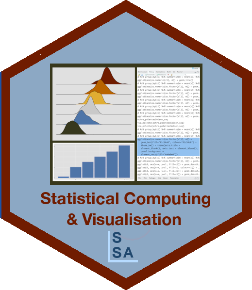

# SSA SCV Tutorial: Deploying your local modelling code into Production with Microsoft Azure



Website: [https://StatSocAus.github.io/tutorial_deploywithazure](https://StatSocAus.github.io/tutorial_deploywithazure)

## Structure of tutorial
 
* Overview of MLOps 
    - What is MLOps?  
    - Who is MLOps?  
    - Experimentation vs Productionisation (Inner Loop vs Outer Loop)  
    - Reference Architecture  
    - Deployment patterns
    - Azure ML Studio Tour
* Converting development code into production quality code  
    - Case Study: NYC Taxi Fare Prediction    
    - Review experimentation code  
    - Split into scripts
    - MLOps additions
* Deploying MLOps pipelines  
    - Pipelines 
    - Infrastructure as Code deployment  
    - Model training  
    - Endpoint deployment and test  
    - Usage / monitoring  
    - Advice for real-world deployments   

## Background  

Participants should have some experience with Python and basic understanding of cloud platforms such as Microsoft Azure, AWS or Google Cloud Platform.  

## Course Schedule

| time | topic |
|------|-------|
|9:00 - 9:05 |	Welcome and overview |
|9:05 - 9:15 |	Setup  |
|9:15 - 10:00 |	Session 1 |
|10:00 - 10:15 | Break |
|10:15 - 11:15 | Session 2 |
|11:15 - 11:30 | Break |
|11:30 - 12:30 | Session 3|

[Session Slides]()

[Zip file of materials]()

## Getting started

1. (RECOMMENDED) Users wanting to run code interactively should have a Python (3.8) environment and IDE setup **before** the workshop. The `environment.yaml` file in this repository was used to set up a virtual conda environment to run examples in this workshop. You can test this by loading the required libraries:  

```
import argparse
from pathlib import Path
import os
import numpy as np
import pandas as pd
from matplotlib import pyplot as plt
from sklearn.ensemble import RandomForestRegressor
from sklearn.metrics import r2_score, mean_absolute_error, mean_squared_error
import mlflow
import mlflow.sklearn
```

2. Git running on your local machine.  

3. Clone this github repository: TBC

2. (OPTIONAL) Users wanting to replicate the Cloud deployment steps will require the following:

    a) Sign up for a subscription with Microsoft Azure. This is a paid service, but Microsoft offers new users with a $200 USD credit to use within 30 days. https://azure.microsoft.com/en-au/free  
    b) Have an active DevOps organisation. *Note that Microsoft have temporarily disabled the free grant of parallel jobs for public projects and for certain private projects in new organizations. However, you can request this grant by submitting a [request](https://aka.ms/azpipelines-parallelism-request). Existing organizations and projects are not affected. Please note that it takes us 2-3 business days to respond to free tier requests.*

**Step 3 is optional. Its not expected that all participants will want to sign up for an account with Azure. The workshop will demonstrate this as a deployment pathway, but it is not mandatory to enjoy the content and apply the principles to other platforms.**


## Links and References  

[MLOps Code Repo]()

[Azure MLOps (v2) Solution Accelerator](https://github.com/Azure/mlops-v2)

[Azure MlOps DevOps Quickstart](https://learn.microsoft.com/en-us/azure/machine-learning/how-to-setup-mlops-azureml)  

